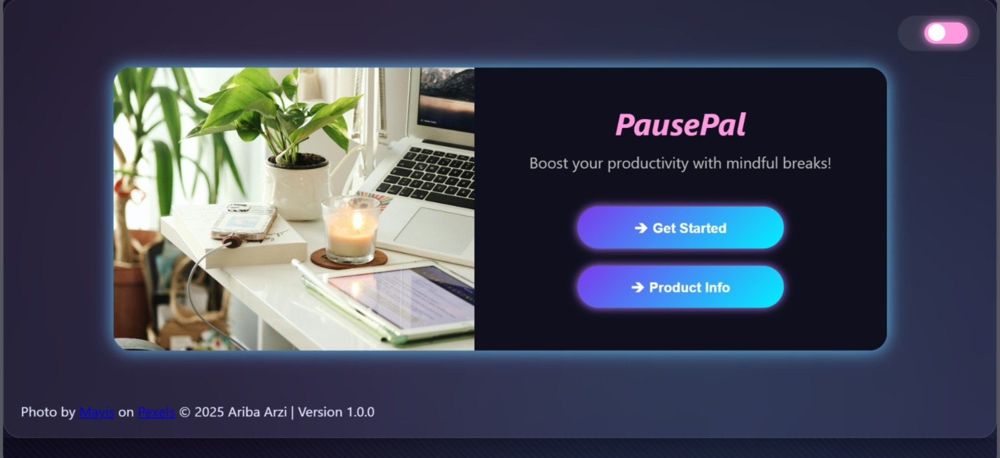
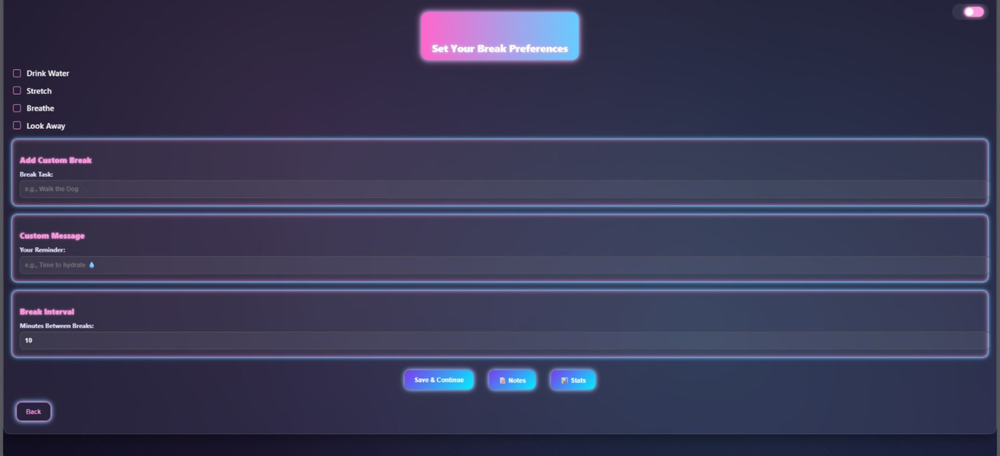
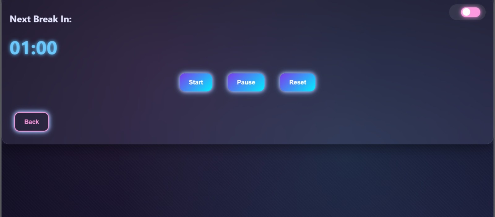
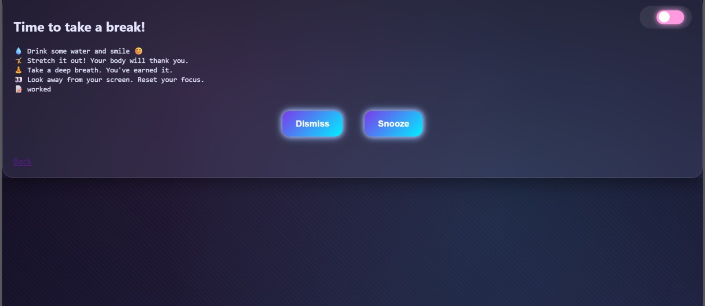
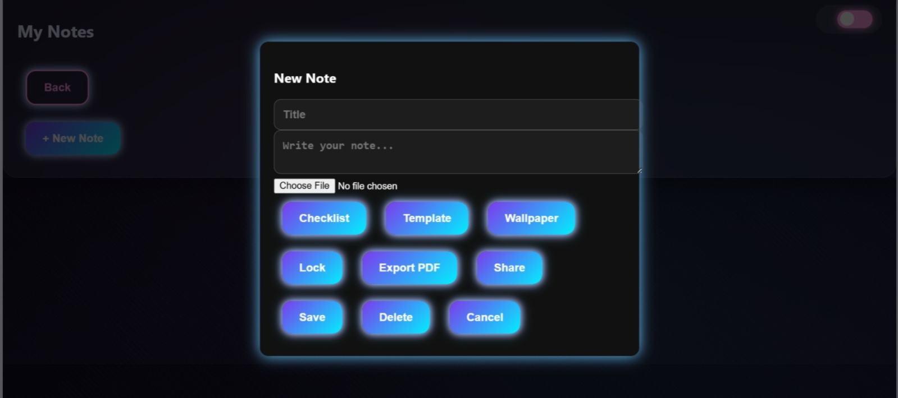
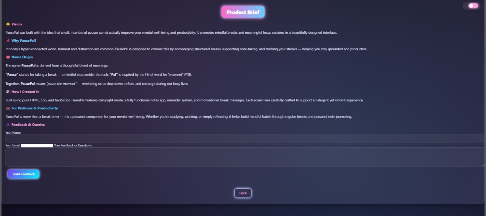

# PausePal 🌸

Boost your productivity with mindful, scheduled breaks — powered by a beautiful neon-themed interface.

## ✨ Features
- Break Timer with customizable intervals
- Custom Break Tasks and Messages
- Break Reminder Alerts
- Notes Pad for jotting thoughts
- Streak & Progress Tracking
- Light/Dark Mode toggle

## 🛠️ Tech Stack
- HTML5, CSS3, JavaScript (Vanilla)
- Neon-Glow Modern UI

## 🚀 How to Run
1. Download the project files.
2. Open `index.html` in your browser.
3. Customize your settings and start using mindful breaks!

## 📸 Live Screenshots

### Welcome Screen


### Settings Screen


### 🟪 Break Timer


### 🟪 Break Reminder


### 🟪 Notes App


### 🟪 Product Info Page

---

## 🧠 How It Works Without Backend

- *Notes App* uses localStorage, which stores data inside your browser, so there's no need for a server.
- *Feedback Form* uses Formspree, which sends submissions directly to your email without any database.

---

## 🚀 Run Locally

```bash
git clone https://github.com/your-username/pausepal.git
cd pausepal
open index.html
```

## 🛠️ File Structure

```
pausepal/
├── index.html
├── style.css
├── script.js
├── screenshots/
│   ├── 1_welcome.jpeg
│   ├── 2_settings.jpeg
│   ├── 3_timer.jpeg
│   ├── 4_reminder.jpeg
│   ├── 5_notes.jpeg
│   ├── 6_productinfo.jpeg
│   └── 7_feedback.jpeg
└── README.md
```

## 📋 Future Enhancements
- Cloud sync for notes and stats
- Mobile version
- Team break coordination
- Pomodoro integration
- More themes and sound support

## 🧑‍💻 Author
Made with 💖 by Ariba Arzi  
📬 Email: aribarzi07@gmail.com  
🔗 Connect on LinkedIn: www.linkedin.com/in/aribaarzi2207

## 🙏 Acknowledgements
- UI Photo by Mayis on Pexels  
- Open-source libraries and Formspree  
- Feedback from early users

**PausePal – Because every moment of pause matters. 🌟**
